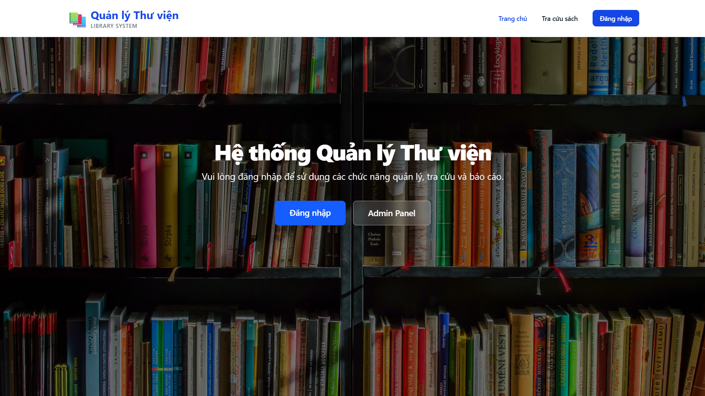
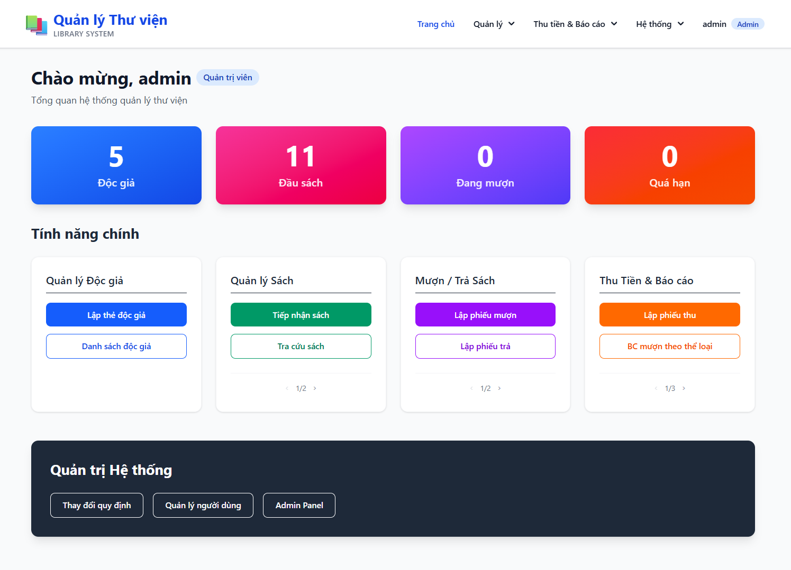

# Library Management System

A comprehensive library management system built with Django, featuring book cataloging, reader management, borrowing/return tracking, and detailed reporting capabilities. 




## Features

- **User Management**: Multi-role authentication system (Manager, Librarian).
- **Book Management**: Complete book cataloging with categories, authors, and inventory tracking.
- **Reader Management**: Reader registration and profile management with multiple reader types.
- **Borrowing System**: Book borrowing and return workflow with due date tracking.
- **Receipt Management**: Financial transaction tracking for library fees and fines.
- **Reports**:
  - Borrowing statistics by category.
  - Overdue books tracking.
  - Borrowing situation reports.
- **System Configuration**: Customizable system parameters (max borrowing days, fine rates, age limits).

## Technology Stack

- **Backend**: Django 5.2.6
- **Web Server**: Gunicorn
- **Reverse Proxy**: Nginx (Alpine)
- **Database**: SQLite (default) / PostgreSQL (supported)
- **Static Files**: WhiteNoise
- **Containerization**: Docker & Docker Compose
- **SSL/TLS**: HTTPS (Self-signed or Cloudflare Tunnel)
- **Frontend**: Django Templates + Tailwind CSS

## Prerequisites

- Docker Engine 20.10+
- Docker Compose v2.0+
- Git
- Python 3.10+ (for local scripts)

## Preview UI/UX

Screenshots of the web interface are available in the image/ directory.




## Local DNS & SSL Configuration (Optional)

To access the application via `https://library.cyberfortress.local` without browser warnings, you need to configure your hosts file and trust the generated Root CA.

### Using a Custom Domain

If you want to use your own domain (e.g., `library.yourdomain.local`), you will need to:

1. **Generate your own Root CA and Leaf Certificate**: Create new self-signed certificates for your domain. You can use tools like `openssl` or `mkcert` to generate:
   - A Root CA certificate (to be trusted by your system/browser)
   - A leaf/server certificate signed by your Root CA (for your custom domain)

2. **Place the certificates in the `certs/` folder**:
   - Your leaf certificate (e.g., `_.yourdomain.local.crt`)
   - Your private key (e.g., `_.yourdomain.local.key`)
   - Your Root CA certificate (e.g., `YourRootCA.crt`)

3. **Update the `.env` file** with your domain and certificate filenames:
   ```env
   DOMAIN_NAME="library.yourdomain.local library.yourdomain.local *.yourdomain.local"
   SSL_CERT_FILE=_.yourdomain.local.crt
   SSL_KEY_FILE=_.yourdomain.local.key
   SSL_CA_FILE=YourRootCA.crt
   ALLOWED_HOSTS=library.yourdomain.local,127.0.0.1,localhost
   ```

4. **Trust your Root CA certificate** on your system (see instructions below).

5. **Update your hosts file** to point your domain to `127.0.0.1`. 

### 1. Update Hosts File

Map the local domain to your localhost IP (`127.0.0.1`).
*Note: if you are using Local DNS, please replace `127.0.0.1` with your local IP, such as `192.168.1.100`.*

**Windows:**

1. Open **PowerShell** as Administrator.
2. Edit the hosts file, enter this command: `notepad C:\Windows\System32\drivers\etc\hosts` or open `C:\Windows\System32\drivers\etc\hosts` with Notepad as Administrator.
3. Add the following line to the end of the file:
```bash
127.0.0.1 library.cyberfortress.local
```

4. Save and close.

**macOS / Linux:**

1. Open Terminal.
2. Edit the hosts file:
```bash
sudo nano /etc/hosts

```


3. Add the following line to the end:
```bash
127.0.0.1 library.cyberfortress.local

```


4. Press `Ctrl+O` (Save), `Enter`, then `Ctrl+X` (Exit).

### 2. Trust the Root Certificate

The system generates a CA certificate at `certs/CyberFortress-RootCA.crt`. You need to add this to your system's Trusted Root store.

**Windows:**

1. Navigate to the `certs/` folder in the project.
2. Double-click `CyberFortress-RootCA.crt`.
3. Click **Install Certificate...**
4. Select **Current User** or **Local Machine** -> **Next**.
5. Select **Place all certificates in the following store**.
6. Click **Browse...** and select **Trusted Root Certification Authorities**.
7. Click **OK** -> **Next** -> **Finish**.
8. Click **Yes** on the security warning dialog.

**macOS:**

1. Open **Keychain Access** (search via Spotlight).
2. Drag and drop `certs/CyberFortress-RootCA.crt` into the **System** keychain.
3. Double-click the imported certificate ("CyberFortress Root CA").
4. Expand the **Trust** section.
5. Set "When using this certificate" to **Always Trust**.
6. Close the window and enter your password to confirm.

**Linux (Ubuntu/Debian):**

1. Copy the certificate to the system folder:
```bash
sudo cp certs/CyberFortress-RootCA.crt /usr/local/share/ca-certificates/CyberFortress-RootCA.crt

```


2. Update the CA store:
```bash
sudo update-ca-certificates

```


*Note: If you use Firefox, you may need to import the certificate manually in Firefox Settings > Privacy & Security > Certificates > View Certificates.*


## Quick Start

The project includes a helper script `start.py` to manage the environment.

### 1. Clone Repository

```bash
git clone https://github.com/WanThinnn/Library-Management-System.git
cd Library-Management-System
```

### 2. Setup Environment

Initialize configuration files and SSL certificates:

```bash
python start.py setup
```

This will:
- check Docker installation.
- Generate local SSL certificates in `certs/`.
- Create `.env` from example.

### 3. Build and Run (Development)

Build the Docker images from source and start the services:

```bash
python start.py build
python start.py up
```

### 4. Initialize Data

Populate the database with sample data (parameters, user groups, permissions, sample books/readers):

```bash
python start.py makemigrations
python start.py migrate
python start.py initdata
```

### 5. Access Application

Open your browser and navigate to:
- URL: `https://library.cyberfortress.local` (accept the self-signed certificate warning)
- Or: `https://localhost`

**Default Credentials:**

- **Manager (Admin)**:
  - Username: `admin`
  - Password: `Admin1234!@#$`

- **Librarian**:
  - Username: `thuthu01`
  - Password: `Thuthu1234!@#$`

## Configuration

### Environment Variables

Edit the `.env` file to configure the system:

- `DEBUG`: Set to `False` for production.
- `SECRET_KEY`: Django secret key (auto-generated by setup).
- `ALLOWED_HOSTS`: Comma-separated list of allowed hostnames.
- `SECURE_SSL_REDIRECT`: Set to `True` to force HTTPS.

### Cloudflare Tunnel

To expose the application securely without opening ports:

1. Add your Tunnel ID and Domain to `.env`:
   ```env
   CLOUDFLARE_TUNNEL_ID=your-uuid
   TUNNEL_DOMAIN=library.yourdomain.com
   ```
2. Place credentials in `cloudflared/`.
3. Start the system with the tunnel profile:
   ```bash
   python start.py --tunnel up
   ```

## Production Deployment

For production, you can use the optimized `docker-compose.prod.yml`.

1. **Build/Pull Images**:
   ```bash
   python start.py --prod setup
   python start.py --prod build
   ```
   *Note: Ensure you build locally if using custom code changes.*

2. **Run Services**:
   ```bash
   python start.py --prod up
   ```

3. **Manage Database**:
   ```bash
   python start.py --prod makemigrations
   python start.py --prod migrate
   python start.py --prod initdata
   ```

## Project Structure

- `start.py`: Cross-platform entrypoint script.
- `src/`: Source code directory.
  - `LibraryApp/`: Main Django application (Views, Models).
  - `LibraryManagementSystem/`: Project settings.
  - `templates/`: HTML templates.
  - `static/`: Static assets (CSS, JS, Images).
- `nginx/`: Nginx configuration and Dockerfile.
- `certs/`: SSL certificates storage.
- `docker-compose.yml`: Development orchestration.
- `docker-compose.prod.yml`: Production orchestration.

## Troubleshooting

- **Permission Denied**:
  If you see permission errors in the app, verify that the database permissions match the code. Run `python start.py initdata` to refresh permissions.

- **SSL Errors**:
  Ensure the Root CA (`certs/CyberFortress-RootCA.crt`) is trusted by your browser or OS.

- **Logs**:
  View container logs to debug issues:
  ```bash
  python start.py logs
  ```

## License

This project is licensed under the MIT License.

## Authors

- **Lại Quan Thiên** - [WanThinnn](https://github.com/WanThinnn)

## Acknowledgments

- University of Information Technology (UIT)
- SE104 - Software Engineering Course
