# Sơ đồ liên kết các màn hình - Library Management System

Sơ đồ dưới đây thể hiện cấu trúc và mối liên kết giữa các màn hình trong hệ thống Quản lý Thư viện.

```mermaid
flowchart LR
    %% Main entry point
    Login["Đăng nhập"]
    Register["Đăng ký"]
    
    %% Password management
    Login --> PWReset["Quên mật khẩu"]
    Login --> Register
    PWReset --> PWResetDone["Đã gửi email"]
    PWReset --> PWResetConfirm["Đặt lại mật khẩu"]
    PWResetConfirm --> PWResetComplete["Hoàn tất đặt lại"]
    
    %% Main screens after login
    Login --> Home["Trang chủ"]
    
    %% Profile management
    Home --> Profile["Thông tin cá nhân"]
    Profile --> ChangePassword["Đổi mật khẩu"]
    
    %% ========== QUẢN LÝ ĐỘC GIẢ (YC1) ==========
    Home --> ReaderMgmt["Quản lý Độc giả"]
    ReaderMgmt --> ReaderCreate["Lập thẻ độc giả"]
    ReaderMgmt --> ReaderList["Danh sách độc giả"]
    ReaderList --> ReaderDetail["Chi tiết độc giả"]
    ReaderDetail --> ReaderEdit["Sửa thông tin"]
    ReaderDetail --> ReaderDelete["Xóa độc giả"]
    
    %% ========== QUẢN LÝ SÁCH (YC2, YC3) ==========
    Home --> BookMgmt["Quản lý Sách"]
    BookMgmt --> BookSearch["Tra cứu sách"]
    BookMgmt --> BookImportSelect["Chọn phương thức nhập"]
    
    BookSearch --> BookDetail["Chi tiết sách"]
    BookDetail --> BookEdit["Sửa thông tin"]
    BookDetail --> BookDelete["Xóa sách"]
    
    BookImportSelect --> BookImport["Nhập thủ công"]
    BookImportSelect --> BookImportExcel["Nhập từ Excel"]
    
    BookMgmt --> BookImportList["DS phiếu nhập"]
    BookImportList --> BookImportDetail["Chi tiết phiếu nhập"]
    BookImportDetail --> BookImportCancel["Hủy phiếu nhập"]
    
    %% ========== MƯỢN SÁCH (YC4) ==========
    Home --> BorrowMgmt["Mượn sách"]
    
    BorrowMgmt --> BorrowBook["Lập phiếu mượn"]
    BorrowMgmt --> BorrowList["DS phiếu mượn"]
    BorrowList --> BorrowDetail["Chi tiết phiếu mượn"]
    BorrowDetail --> BorrowCancel["Hủy phiếu mượn"]
    
    %% ========== TRẢ SÁCH (YC5) ==========
    Home --> ReturnMgmt["Trả sách"]
    
    ReturnMgmt --> ReturnBook["Lập phiếu trả"]
    ReturnMgmt --> ReturnList["DS phiếu trả"]
    ReturnList --> ReturnDetail["Chi tiết phiếu trả"]
    ReturnDetail --> ReturnCancel["Hủy phiếu trả"]
    
    %% ========== THU TIỀN PHẠT (YC6) ==========
    Home --> ReceiptMgmt["Thu tiền phạt"]
    
    ReceiptMgmt --> ReceiptForm["Lập phiếu thu"]
    ReceiptMgmt --> ReceiptList["DS phiếu thu"]
    ReceiptList --> ReceiptDetail["Chi tiết phiếu thu"]
    ReceiptDetail --> ReceiptCancel["Hủy phiếu thu"]
    
    %% ========== BÁO CÁO (YC7) ==========
    Home --> ReportMgmt["Báo cáo"]
    
    ReportMgmt --> ReportBorrowCategory["BC mượn theo thể loại"]
    ReportMgmt --> ReportBorrowSituation["BC tình hình mượn"]
    ReportMgmt --> ReportOverdue["BC sách trả trễ"]
    ReportMgmt --> ReportFineCollection["BC tiền phạt thu được"]
    
    %% ========== THAY ĐỔI QUY ĐỊNH (YC8) ==========
    Home --> SystemMgmt["Quản lý Hệ thống"]
    
    SystemMgmt --> ParameterUpdate["Thay đổi quy định"]
    
    %% Reader Types
    SystemMgmt --> ReaderTypeList["DS loại độc giả"]
    ReaderTypeList --> ReaderTypeCreate["Thêm loại độc giả"]
    ReaderTypeList --> ReaderTypeEdit["Sửa loại độc giả"]
    ReaderTypeList --> ReaderTypeDelete["Xóa loại độc giả"]
    
    %% User Management
    SystemMgmt --> UserList["DS người dùng"]
    UserList --> UserCreate["Thêm người dùng"]
    UserList --> UserEdit["Sửa người dùng"]
    UserList --> UserDelete["Xóa người dùng"]
    
    %% Permission Management - User Groups
    SystemMgmt --> UserGroupList["DS nhóm quyền"]
    UserGroupList --> UserGroupCreate["Thêm nhóm quyền"]
    UserGroupList --> UserGroupEdit["Sửa nhóm quyền"]
    UserGroupList --> UserGroupDelete["Xóa nhóm quyền"]
    UserGroupList --> PermissionMatrix["Ma trận phân quyền"]
    
    %% Function Management
    SystemMgmt --> FunctionList["DS chức năng"]
    FunctionList --> FunctionCreate["Thêm chức năng"]
    FunctionList --> FunctionEdit["Sửa chức năng"]
    FunctionList --> FunctionDelete["Xóa chức năng"]
    
    %% Styling
    classDef mainScreen fill:#4299e1,stroke:#2b6cb0,color:#fff
    classDef subScreen fill:#48bb78,stroke:#2f855a,color:#fff
    classDef formScreen fill:#ed8936,stroke:#c05621,color:#fff
    classDef detailScreen fill:#9f7aea,stroke:#6b46c1,color:#fff
    classDef reportScreen fill:#f56565,stroke:#c53030,color:#fff
    classDef cancelScreen fill:#fc8181,stroke:#c53030,color:#fff
    
    class Login,Home mainScreen
    class ReaderMgmt,BookMgmt,BorrowMgmt,ReturnMgmt,ReceiptMgmt,ReportMgmt,SystemMgmt subScreen
    class ReaderCreate,BookImport,BookImportExcel,BorrowBook,ReturnBook,ReceiptForm,UserCreate,UserGroupCreate,FunctionCreate,ReaderTypeCreate,ParameterUpdate,ChangePassword,Register,PWReset,PWResetConfirm formScreen
    class ReaderDetail,BookDetail,BorrowDetail,ReturnDetail,ReceiptDetail,BookImportDetail detailScreen
    class ReportBorrowCategory,ReportBorrowSituation,ReportOverdue,ReportFineCollection reportScreen
    class BorrowCancel,ReturnCancel,ReceiptCancel,BookImportCancel,ReaderDelete,BookDelete,UserDelete,UserGroupDelete,FunctionDelete,ReaderTypeDelete cancelScreen
```

## Chú thích màu sắc

| Màu          | Ý nghĩa                       |
| ------------ | ----------------------------- |
| 🔵 Xanh dương | Màn hình chính (Login, Home)  |
| 🟢 Xanh lá    | Màn hình quản lý (Menu chính) |
| 🟠 Cam        | Màn hình form (Thêm/Sửa)      |
| 🟣 Tím        | Màn hình chi tiết             |
| 🔴 Đỏ         | Màn hình báo cáo              |
| 🩷 Hồng       | Màn hình hủy/xóa              |

---

## Danh sách các màn hình theo nhóm chức năng

### 1. Xác thực & Tài khoản (6 chức năng)
- Đăng nhập hệ thống
- Đăng xuất hệ thống
- Đăng ký tài khoản
- Quên mật khẩu / Đặt lại mật khẩu
- Thông tin cá nhân / Đổi mật khẩu

### 2. Quản lý Độc giả - YC1 (5 chức năng)
- Lập thẻ độc giả
- Danh sách độc giả
- Chi tiết độc giả
- Chỉnh sửa thông tin độc giả
- Xóa độc giả

### 3. Quản lý Sách - YC2, YC3 (10 chức năng)
- Chọn phương thức nhập sách
- Nhập sách thủ công
- Nhập sách từ Excel
- Danh sách phiếu nhập sách
- Chi tiết phiếu nhập sách
- Hủy phiếu nhập sách
- Tra cứu sách
- Chi tiết sách
- Chỉnh sửa thông tin sách
- Xóa sách

### 4. Mượn sách - YC4 (4 chức năng)
- Lập phiếu mượn sách
- Danh sách phiếu mượn
- Chi tiết phiếu mượn
- Hủy phiếu mượn

### 5. Trả sách - YC5 (4 chức năng)
- Lập phiếu trả sách
- Danh sách phiếu trả
- Chi tiết phiếu trả
- Hủy phiếu trả (Hoàn tác)

### 6. Thu tiền phạt - YC6 (4 chức năng)
- Lập phiếu thu tiền phạt
- Danh sách phiếu thu
- Chi tiết phiếu thu
- Hủy phiếu thu

### 7. Báo cáo - YC7 (4 chức năng)
- Báo cáo mượn sách theo thể loại
- Báo cáo tình hình mượn sách
- Báo cáo sách trả trễ
- Báo cáo tiền phạt thu được

### 8. Thay đổi quy định - YC8 (2 chức năng)
- Thay đổi quy định hệ thống
- Đặt lại quy định mặc định

### 9. Quản lý Loại độc giả (4 chức năng)
- Danh sách loại độc giả
- Thêm loại độc giả
- Sửa loại độc giả
- Xóa loại độc giả

### 10. Quản lý Người dùng (4 chức năng)
- Danh sách người dùng
- Thêm người dùng mới
- Sửa thông tin người dùng
- Xóa người dùng

### 11. Phân quyền (9 chức năng)
- Danh sách nhóm quyền
- Thêm nhóm quyền
- Sửa nhóm quyền
- Xóa nhóm quyền
- Ma trận phân quyền
- Danh sách chức năng
- Thêm chức năng
- Sửa chức năng
- Xóa chức năng

---

## Thống kê tổng hợp

| Nhóm chức năng          | Số lượng |
| ----------------------- | :------: |
| Xác thực & Tài khoản    |    6     |
| Quản lý Độc giả (YC1)   |    5     |
| Quản lý Sách (YC2, YC3) |    10    |
| Mượn sách (YC4)         |    4     |
| Trả sách (YC5)          |    4     |
| Thu tiền phạt (YC6)     |    4     |
| Báo cáo (YC7)           |    4     |
| Thay đổi quy định (YC8) |    2     |
| Quản lý Loại độc giả    |    4     |
| Quản lý Người dùng      |    4     |
| Phân quyền              |    9     |
| **TỔNG CỘNG**           |  **56**  |
