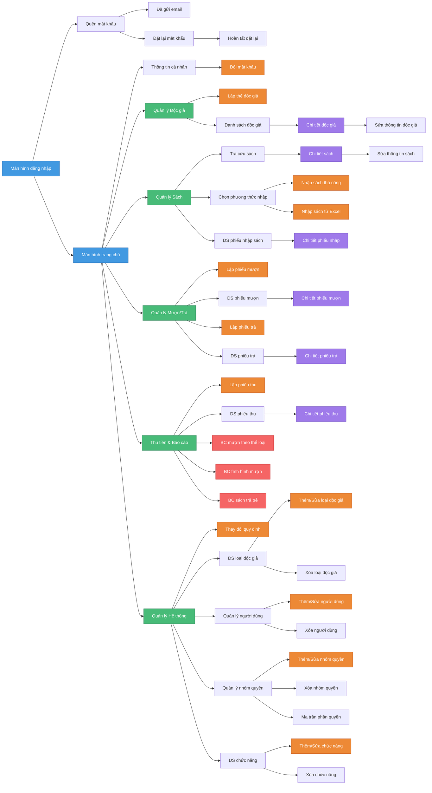

# Sơ đồ liên kết các màn hình - Library Management System

Sơ đồ dưới đây thể hiện cấu trúc và mối liên kết giữa các màn hình trong hệ thống Quản lý Thư viện.

## Chú thích màu sắc

| Màu | Ý nghĩa |
|-----|---------|
| 🔵 Xanh dương | Màn hình chính (Login, Home) |
| 🟢 Xanh lá | Màn hình quản lý (Menu chính) |
| 🟠 Cam | Màn hình form (Thêm/Sửa/Xóa) |
| 🟣 Tím | Màn hình chi tiết |
| 🔴 Đỏ | Màn hình báo cáo |

## Danh sách các màn hình

### Xác thực & Tài khoản
- Đăng nhập
- Quên mật khẩu / Đặt lại mật khẩu
- Thông tin cá nhân
- Đổi mật khẩu

### Quản lý Độc giả
- Lập thẻ độc giả
- Danh sách độc giả
- Chi tiết / Sửa thông tin độc giả

### Quản lý Sách
- Tra cứu sách
- Chi tiết / Sửa thông tin sách
- Nhập sách thủ công / Excel
- Danh sách phiếu nhập

### Mượn/Trả Sách
- Lập phiếu mượn
- Danh sách phiếu mượn / Chi tiết
- Lập phiếu trả
- Danh sách phiếu trả / Chi tiết

### Thu tiền & Báo cáo
- Lập phiếu thu
- Danh sách phiếu thu / Chi tiết
- Báo cáo mượn theo thể loại
- Báo cáo tình hình mượn
- Báo cáo sách trả trễ

### Quản lý Hệ thống
- Thay đổi quy định
- Quản lý loại độc giả
- Quản lý người dùng
- Quản lý nhóm quyền
- Ma trận phân quyền
- Quản lý chức năng
